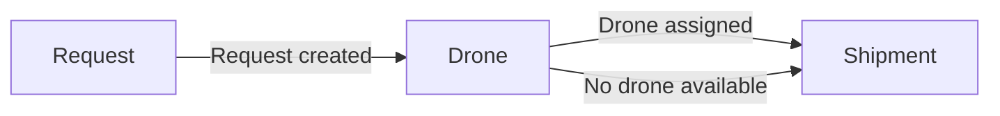
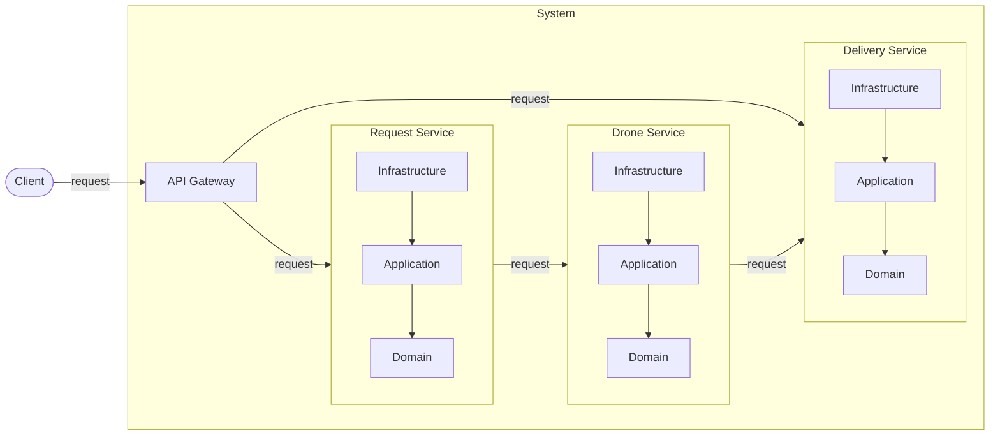

# Shipping on the Air - Living Document

**v1.3.3**

---

## 1. Analysis

### 1.1 User Stories

#### Delivery Request

    As a user,
    I want to request a package delivery
    so that I can send a package from one place to another.

#### Shipment Tracking

    As a user,
    I want to track the status of my shipment,
    so that I can know whether my package is scheduled, in progress, completed or cancelled.

    As a user,
    I want to track the current position of the drone,
    so that I can know where my package is in real time.

    As a user,
    I want to know the remaining delivery time,
    so that I can know how long it will take to complete the delivery.

### 1.2 Use Cases

The actors involved are:
- **User**: the actor that accesses the system to request and track package deliveries.
- **System**: the Shipping on the Air system.

#### Request a Delivery

- **Primary actor**: User  
- **Goal**: Submit a new package delivery request.  
- **Preconditions**: None.  
- **Postconditions**: A shipment is created and a drone is assigned to the delivery.

**Main flow**

1. The user submits a delivery request.
2. The system validates the request.
3. The system searches for available drones that can complete the delivery.
4. The system assigns the most suitable drone to the delivery.
5. The system creates a shipment and confirms it to the user.

**Alternate/Exception flows**
- 2a: Invalid request (e.g. invalid coordinates, negative weight) → System returns an error.
- 3a: No available drone found → System cancels the shipment and notifies the user.

---

#### Track a Shipment

- **Primary actor**: User  
- **Goal**: Monitor the current status, position and remaining time of a shipment.  
- **Preconditions**: A shipment exists.  
- **Postconditions**: The user receives the requested tracking information.

**Main flow**

1. The user requests tracking information, specifying the shipment to track.
2. The system retrieves the current status of the shipment.
3. The system calculates the current position of the drone.
4. The system calculates the remaining delivery time.
5. The system returns the tracking information to the user.

**Alternate/Exception flows**
- 1a: Shipment not found → System returns an error.
- 3a: Drone not yet assigned → System returns position not available.

### 1.3 Functional Requirements

- The user can request a package delivery specifying pickup location, delivery location, pickup date/time and time limit.
- The user can know the current status of the shipment.
- The user can track the current position of the drone in real time.
- The user can know the remaining time to complete the delivery.

### 1.4 Non-Functional Requirements

- **Availability**: the system must always be reachable even in case of minor failures.
- **Performance**: the system must respond in real time for tracking requests.
- **Scalability**: the system must handle multiple simultaneous deliveries.
- **Maintainability**: the system must be modifiable and deployable without changes to one component impacting the others.

### 1.5 Domain Model

#### 1.5.1 Strategic Design

##### Ubiquitous Language

- **Shipping on the Air**
    - The online system that allows users to request package deliveries through drones.
    - It provides functionalities to request a delivery, track the package in real time and monitor the delivery status.

- **User**
    - The actor that accesses the system to request and track package deliveries.

- **Package**
    - The physical item to be delivered from a pickup location to a delivery location.

- **Drone**
    - The autonomous vehicle used to deliver packages.

- **Delivery Request**
    - The request submitted by a user to deliver a package from a pickup location to a delivery location.
    - It specifies a pickup date/time and a maximum delivery time limit.

- **Shipment**
    - The actual delivery process associated to a delivery request, once a drone has been assigned.
    - It tracks the current status and position of the delivery.

- **Status**
    - The current state of a shipment, which can be:
        - `Scheduled`: a drone has been assigned to the shipment.
        - `In Progress`: the drone has reached the pickup location and is flying towards the delivery location.
        - `Completed`: the drone has reached the delivery location.
        - `Cancelled`: no drone is available for the shipment.

- **Position**
    - A geographic location expressed as latitude and longitude.
    - Used to represent the pickup location, delivery location and current drone position.

- **To request a delivery** *(Action)*
    - Performed by the user to submit a new delivery request, specifying pickup location, delivery location, pickup date/time and time limit.

- **To assign a drone** *(Action)*
    - Performed by the system to select and assign the most suitable available drone to a delivery request.

- **To track a shipment** *(Action)*
    - Performed by the user to monitor the delivery, including the current status of the shipment, the current position of the drone and the estimated time remaining to complete the delivery.

##### Bounded Contexts

- **Request**: creates and validates delivery requests.
- **Drone**: check drones availability and assigns drones.
- **Shipment**: tracks the status of the shipments, the current positions of drones and the remaining time to complete deliveries.

##### Context Map

##### Domain Events

- **Request**:
    - `Request created`: published when the user creates a shipment request.

- **Drone**:
    - `Drone assigned`: published when a drone is successfully assigned to a shipment.
    - `No drone available`: published when no drone is available for the shipment.

- **Shipment**:
    - No domain events published; only consumes events from other contexts.

#### 1.5.2 Tactical Design

##### Request

- **Entities**:
    - `User`: represents the user that submitted the delivery request.
    - `Package`: represents the package to be delivered.
- **Aggregates**:
    - `Shipment` *(root)*: represents the delivery request, composed of `User` and `Package`.
- **Value Objects**:
    - `Position`: represents a geographic location expressed as latitude and longitude.
- **Invariants**:
    - Package weight must be greater than 0.
    - Delivery time limit must be greater than 0.
    - Pickup and delivery coordinates must be valid.

##### Drone

- **Entities**:
    - `Drone`: represents the drone available for deliveries.
- **Value Objects**:
    - `Position`: represents the current geographic position of the drone.
- **Invariants**:
    - Drone weight capacity must be equal or greater than the package weight.
    - Drone must be able to complete the delivery within the time limit.
    - Drone battery must be sufficient to cover the full route.
    - The assigned drone is the one closest to the pickup location.

##### Shipment

- **Aggregates**:
    - `Shipment` *(root)*: represents the delivery process, composed of `Position`.
- **Value Objects**:
    - `Position`: represents a geographic location expressed as latitude and longitude.
- **Domain Types**:
    - `ShipmentStatus`: represents the possible states of a shipment (`Scheduled`, `In Progress`, `Completed`, `Cancelled`).

## 2. Design

### 2.1 Architecture

#### Architectural Style

The system adopts a **microservices** architectural style, decomposing the domain into independent services, each responsible for a specific bounded context:

- **API Gateway**: entry point of the system, responsible for routing requests from the client to the appropriate microservice.
- **Request Service**: implements the **Request** bounded context.
- **Drone Service**: implements the **Drone** bounded context.
- **Delivery Service**: implements the **Shipment** bounded context.

#### Internal Architecture

Each microservice adopts a **clean architecture** style, organized into three layers:
- **Domain**: contains the core business logic, including entities, aggregates, value objects and domain events.
- **Application**: contains the application logic, orchestrating the domain objects to fulfill use cases, and defines the ports used by the infrastructure layer.
- **Infrastructure**: contains the adapters that implement the ports defined in the application layer.

Clean architecture was chosen because it explicitly separates the application logic from the domain logic, providing a clearer structure for orchestrating use cases without mixing them with the core domain, and making the system easier to extend and maintain in case of future changes.

### 2.2 Functional Requirements Assignment

- **Request Service**: 
  - The user can request a package delivery.

- **Drone Service**: no direct functional requirements.

- **Delivery Service**:
  - The user can know the current status of the shipment.
  - The user can track the current position of the drone.
  - The user can know the remaining time to complete the delivery.

### 2.3 Non-Functional Requirements Conformance

The non-functional requirements are satisfied by the following architectural choices:

- **Availability**: independence of microservices — if one service goes down, the others continue to operate.
- **Performance**: synchronous interaction model, which ensures real-time responses for tracking requests.
- **Scalability**: microservices architecture, which allows each service to scale independently.
- **Maintainability**: clean architecture and microservices style, which allows each service to be modified and deployed independently.

### 2.4 API Design

#### 2.4.1 Conceptual Design

##### Interaction Model

All interactions are synchronous, following a pipeline pattern in which each request is handled sequentially by multiple microservices.

- **Client → API Gateway**: the client expects an immediate response.
- **API Gateway → Microservices**: the API Gateway waits for the response to return it to the client.
- **Microservices → Microservices**: in some cases, a microservice may require data produced by another service to complete the request.

##### Execution Model

Each microservice adopts an asynchronous **event-loop** execution model, using a pool of event-loop threads to handle many concurrent requests efficiently. Although interactions are synchronous at the communication level, each microservice processes requests in a non-blocking way.  
This model was chosen to satisfy the scalability requirement, allowing each microservice to handle multiple simultaneous deliveries without blocking threads on I/O operations.

#### 2.4.2 Technical Design

- **Interaction**: REST (RPI) is chosen to implement synchronous communication between microservices.
- **Execution**: Vert.x is chosen to implement the asynchronous event-loop execution.